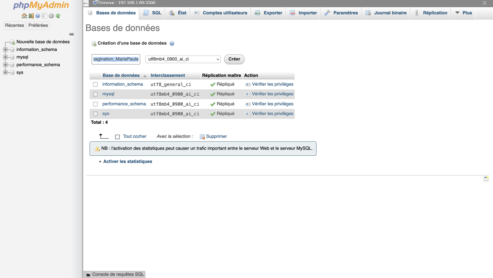
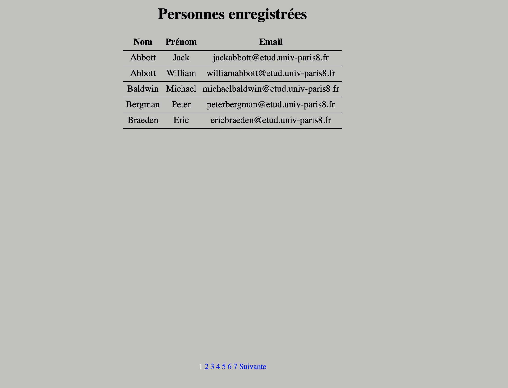
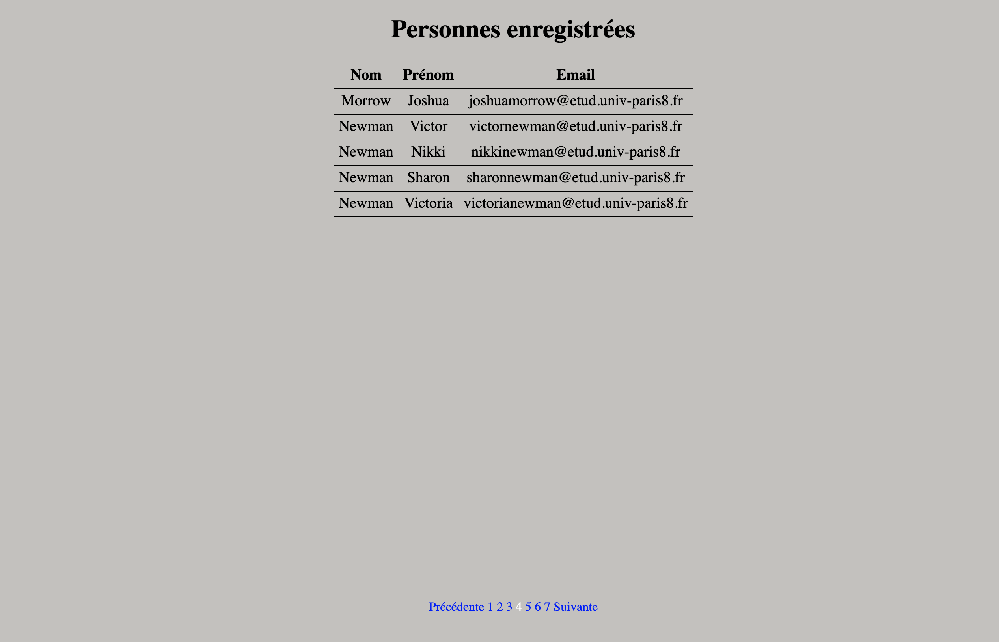
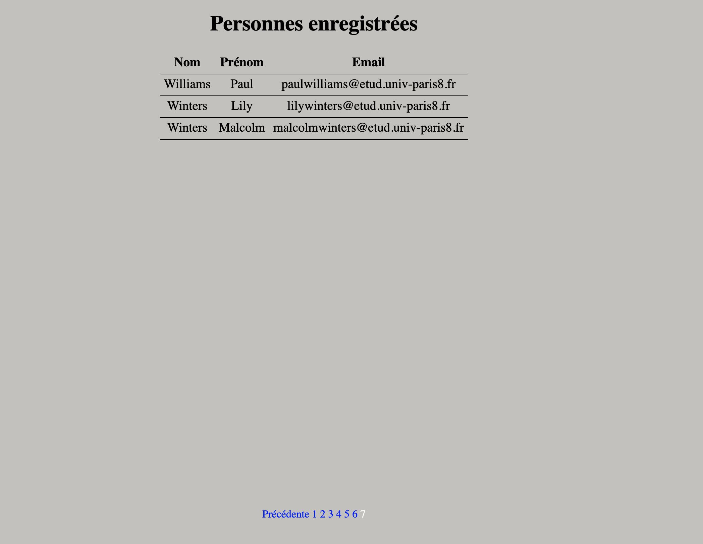

# Sujet : Pagination
## Consigne
La consigne pour se projet est de mettre en place une présentation permettant de naviguer dans un long contenu. Ainsi, au lieu d'avoir à scroller sur toute une page pour lire toutes les informations, on avance sur les différentes pages contenant un bout du contenu.

## Langages
J'ai implémenter le code en utilisant PHP, HTML et CSC.

## Base de données
J'ai utilisé comme système de gestion de base de données mysql.

## Utilisation
#### Attention pour éviter des erreurs :
* Utilier mysql comme base de données !
* Pour lancer le programme par le biais de docker, vérifier que les ports 3306 et 8899 sont bien libre !

#### Mise en place du server mysql et phpmyadmin avec docker
* Installer docker en lançant ./installDocker.sh
* lancer mysql et phpmyadmin avec la commande ./setDocketEnv.sh

#### Mise en place de la base de donnée avec phpmyadmin
* (avec docker) ouvrir dans le navigateur http://localhost:8899/ (sinon) ouvir le phpmyadmin de la machine
* Dans la partie serveur, entrer l'adresse ip (par exemple avec la commande ifconfig docker0 ou ifconfig en0). Exemple ici avec adresse = 111.11.0.1.
   * Serveur : 111.11.0.1:3306
   * Utilisateur : root
   * Mot de passe : my-secret-pw
   * Créer une nouvelle base de données "tp1_pagination_MariePaule"
   
   * Importer la base de données personnes.sql dans phpmyadmin.

## Exemples

